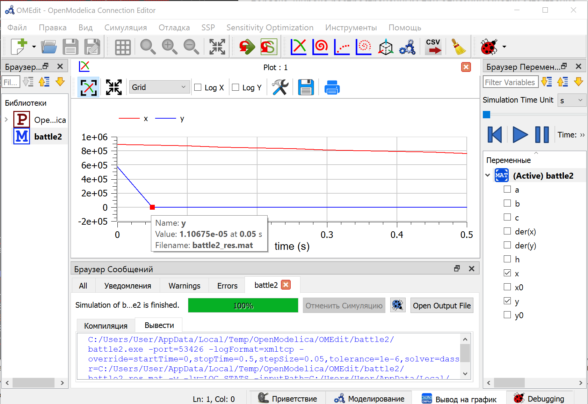

# Цель работы

Построить графики изменения численности войск армии Х и армии У для следующих случаев: 

- Модель боевых действий между регулярными войсками;

- Модель ведения боевых действий с участием регулярных войск и 
партизанских отрядов.

# Задание работы

### Вариант 37

Между страной Х и страной У идет война. Численность состава войск 
исчисляется от начала войны, и являются временными функциями 
$x(t)$ и $y(t)$. В начальный момент времени страна Х имеет армию численностью 895 000 человек, а в распоряжении страны У армия численностью в 577 000 человек. Для упрощения модели считаем, что коэффициенты $a, b, c, h$ постоянны. Также считаем $P(t)$, $Q(t)$ непрерывные функции.

1. $$\frac{dx}{dt}  = -0.34(t)x(t) - 0.93(t)y(t) + 2sin(t)$$

$$\frac{dy}{dt}  = -0.54(t)x(t) - 0.29(t)y(t) + cos(t) + 3$$

2. $$\frac{dx}{dt}  = -0.31(t)x(t) - 0.88(t)y(t) + 2sin(2t)$$

$$\frac{dy}{dt}  = -0.41(t)x(t) - 0.41(t)y(t) + cos(t) + 3$$

# Теоретическое введение

**Законы Ланчестера**
— математическая формула для расчета относительных сил пары сражающихся сторон — подразделений вооруженных сил.[1]

# Выполнение лабораторной работы

## Постановка задачи

В первом случае численность регулярных войск определяется тремя 
факторами:

- скорость уменьшения численности войск из-за причин, не связанных с боевыми действиями (болезни, травмы, дезертирство);

- скорость потерь, обусловленных боевыми действиями противоборствующих сторон (что связанно с качеством стратегии, уровнем вооружения, профессионализмом солдат и т.п.);

- скорость поступления подкрепления (задаётся некоторой функцией от времени).

В этом случае модель боевых действий между регулярными войсками 
описывается следующим образом:

$$\frac{dx}{dt}  = -a(t)x(t) - b(t)y(t) + P(t)$$

$$\frac{dy}{dt}  = -c(t)x(t) - h(t)y(t) +Q(t)$$

Потери, не связанные с боевыми действиями, описывают члены $-a(t)x(t)$ и $-h(t)y(t)$, члены $-b(t)y(t)$ и $-c(t)x(t)$ отражают потери на поле боя. Коэффициенты $b(t)$ и $c(t)$ указывают на эффективность боевых действий со стороны у и х соответственно, $a(t), h(t)$ - величины, характеризующие степень влияния различных факторов на потери. Функции  $P(t), Q(t)$ учитывают возможность подхода подкрепления к войскам Х и У в течение одного дня.

Во втором случае в борьбу добавляются партизанские отряды. Нерегулярные войска в отличии от постоянной армии менее уязвимы, так как действуют скрытно, в этом случае сопернику приходится действовать неизбирательно, по площадям, занимаемым партизанами. Поэтому считается, что тем потерь партизан, проводящих свои операции в разных местах на некоторой известной территории, пропорционален не только численности армейских соединений, но и численности самих партизан. В результате модель принимает вид:

$$\frac{dx}{dt}  = -a(t)x(t) - b(t)y(t) + P(t)$$

$$\frac{dy}{dt}  = -c(t)x(t)y(t) - h(t)y(t) +Q(t)$$

В простейшей модели борьбы двух противников коэффициенты $b(t)$ и $c(t)$ являются постоянными. Попросту говоря, предполагается, что каждый солдат армии x убивает за единицу времени c солдат армии y (и, соответственно, каждый солдат армии y убивает b солдат армии x). Также не учитываются потери,не связанные с боевыми действиями, и возможность подхода подкрепления. Состояние системы описывается точкой (x,y) положительного квадранта плоскости. Координаты этой точки, x и y - это численности противостоящих армий. Тогда модель принимает вид:

$$
\begin{cases}
\frac{dx}{dt}=-a(t)x(t)-b(t)y(t)+P(t)\\
\frac{dy}{dt}=-c(t)x(t)y(t)-h(t)y(t)+Q(t)
\end{cases}
$$

Это - жесткая модель, которая допускает точное решение:

$$\frac{dx}{dy} = \frac{by}{cx}$$
$$ cxdx = bydy, cx_{2}-by_{2} = C$$

Эволюция численностей армий x и y происходит вдоль гиперболы, заданной этим уравнением (@fig:001). По какой именно гиперболе пойдет война, зависит от начальной точки. 

{#fig:001 width=100%}

Эти гиперболы разделены прямой $sqrt{c}x = sqrt{b}y$. Если начальная точка лежит выше этой прямой, то гипербола выходит на ось y. Это значит, что в ходе войны численность армии x уменьшается до нуля (за конечное время). Армия y выигрывает, противник уничтожен.

Если начальная точка лежит ниже, то выигрывает армия x. В разделяющем эти случаи состоянии (на прямой) война заканчивается истреблением обеих армий. Но на это требуется бесконечно большое время: конфликт продолжает тлеть, когда оба противника уже обессилены.
Вывод модели таков: для борьбы с вдвое более многочисленным противником нужно в четыре раза более мощное оружие, с втрое более многочисленным - в девять раз и т. д. (на это указывают квадратные корни в уравнении прямой).

Стоит помнить, что эта модель сильно идеализирована и неприменима к 
реальной ситуации. Но может использоваться для начального анализа. 

Если рассматривать второй случай (война между регулярными войсками и партизанскими отрядами) с теми же упрощениями, то модель (2) принимает вид: 

$$
\begin{cases}
\frac{dx}{dt}=-b(t)y(t)\\
\frac{dy}{dt}=-c(t)x(t)y(t)
\end{cases}
$$

Эта система приводится к уравнению:

$$\frac{d}{dt}(\frac{b}{2}x_{2}(t)-cy(t)) = 0$$

которое при заданных начальных условиях имеет единственное решение:

$$\frac{b}{2}x_{2}(t)-cy(t)) = \frac{b}{2}x_{2}(0)-cy(0) = C_{1}$$

{#fig:002 width=100%}

Из (@fig:002) видно, что при $C_{1} > 0$ побеждает регулярная армия, при $C_{1} < 0$ побеждают партизаны. Аналогично противоборству регулярных войск, победа обеспечивается не только начальной численностью, но и боевой выучкой и качеством вооружения. При $C_{1} > 0$ получаем соотношение $\frac{b}{2}x_{2}(0) > cy(0)$. Чтобы одержать победу партизанам необходимо увеличить коэффициент c и повысить свою начальную численность на соответствующую величину. Причем это 
увеличение, с ростом начальной численности регулярных войск $(x(0))$, должно расти не линейно, а пропорционально второй степени $x(0)$. Таким образом, можно сделать вывод, что регулярные войска находятся в более выгодном положении, так как неравенство для них выполняется прим меньшем росте начальной численности войск.

Рассмотренные простейшие модели соперничества соответствуют системам 
обыкновенных дифференциальных уравнений второго порядка, широко 
распространенным при описании многих естественно научных объектов.

## Код в OpenModelica
Задаем параметры и прописываем функцию, записываем дифференциальное уравнение.(@fig:003)(@fig:004)

{#fig:003 width=100%}

Получаем, что примерно на 1.85с моделирования численность войска у падает до 0. (@fig:005)

{#fig:005 width=100%}

Теперь для второго случая:

{#fig:004 width=100%}

Получаем, что примерно на 0.05с моделирования численность войска у падает до 0. (@fig:006)

{#fig:006 width=100%}

# Вывод

Построили графики изменения численности войск армии Х и армии У для следующих случаев: 

- Модель боевых действий между регулярными войсками

- Модель ведения боевых действий с участием регулярных войск и 
партизанских отрядов.

# Список литературы

1. Wikipedia: Законы Осипова — Ланчестера ( [1]: [https://ru.wikipedia.org/wiki/%D0%97%D0%B0%D0%BA%D0%BE%D0%BD%D1%8B_%D0%9E%D1%81%D0%B8%D0%BF%D0%BE%D0%B2%D0%B0_%E2%80%94_%D0%9B%D0%B0%D0%BD%D1%87%D0%B5%D1%81%D1%82%D0%B5%D1%80%D0%B0] )
2. Теоретические материалы курса.