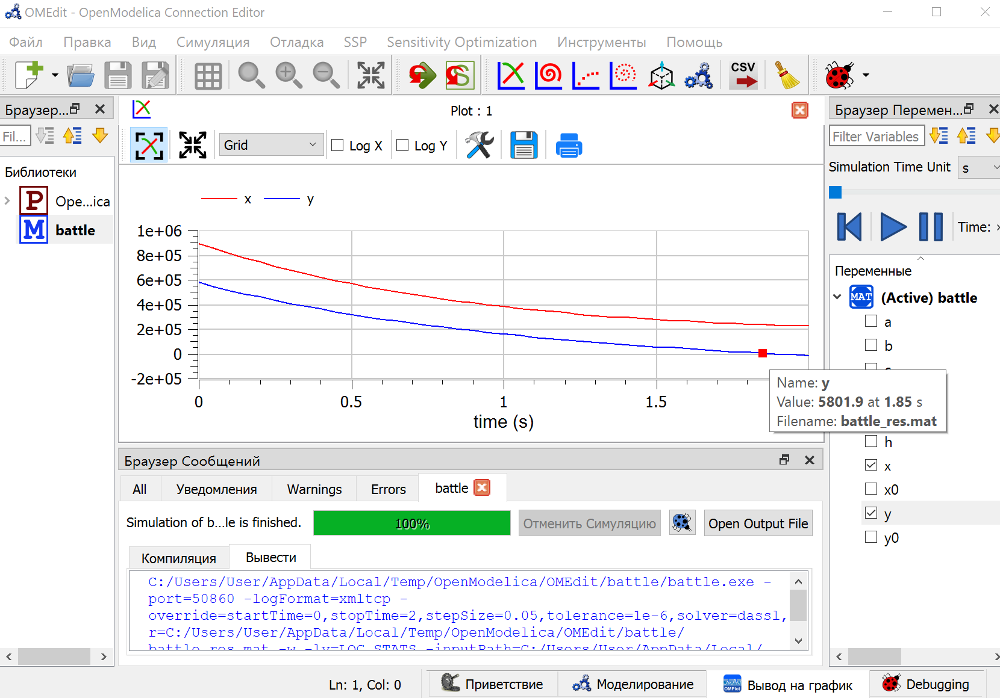
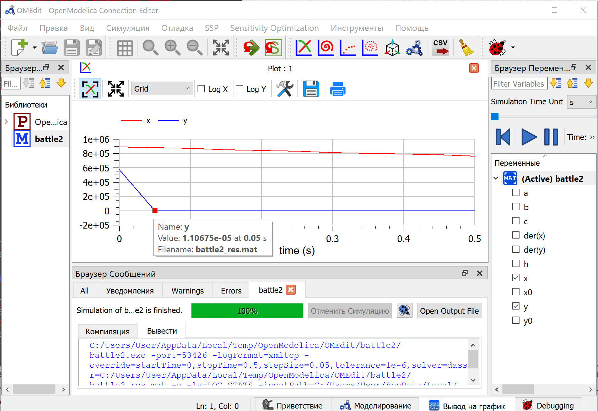

## Цель работы

Построить графики изменения численности войск армии Х и армии У для следующих случаев: 

- Модель боевых действий между регулярными войсками;

- Модель ведения боевых действий с участием регулярных войск и 
партизанских отрядов.

## Задание работы
Между страной Х и страной У идет война. Численность состава войск 
исчисляется от начала войны, и являются временными функциями 
$x(t)$ и $y(t)$. В начальный момент времени страна Х имеет армию численностью 895 000 человек, а в распоряжении страны У армия численностью в 577 000 человек. Для упрощения модели считаем, что коэффициенты $a, b, c, h$ постоянны. Также считаем $P(t)$, $Q(t)$ непрерывные функции.

1. $$\frac{dx}{dt}  = -0.34(t)x(t) - 0.93(t)y(t) + 2sin(t)$$

$$\frac{dy}{dt}  = -0.54(t)x(t) - 0.29(t)y(t) + cos(t) + 3$$

## Задание работы

2. $$\frac{dx}{dt}  = -0.31(t)x(t) - 0.88(t)y(t) + 2sin(2t)$$

$$\frac{dy}{dt}  = -0.41(t)x(t) - 0.41(t)y(t) + cos(t) + 3$$

## Теоретическое введение

Законы Ланчестера — математическая формула для расчета относительных сил пары сражающихся сторон — подразделений вооруженных сил.

## Дифференциальные уравнения 1 случай

В первом случае модель боевых действий между регулярными войсками 
описывается следующим образом:

$$\frac{dx}{dt}  = -a(t)x(t) - b(t)y(t) + P(t)$$

$$\frac{dy}{dt}  = -c(t)x(t) - h(t)y(t) +Q(t)$$

$b(t)$ коэффициент эффективность боевых действий у

$c(t)$ коэффициент эффективность боевых действий х

$a(t), h(t)$ - величины, характеризующие степень влияния различных факторов на потери

$P(t), Q(t)$ учитывают возможность подхода подкрепления к войскам Х и У

## Дифференциальные уравнения 2 случай

Во втором случае в борьбу добавляются партизанские отряды. В результате модель принимает вид:

$$\frac{dx}{dt}  = -a(t)x(t) - b(t)y(t) + P(t)$$

$$\frac{dy}{dt}  = -c(t)x(t)y(t) - h(t)y(t) +Q(t)$$

В этой системе все величины имею тот же смысл, что и в 1 системе.

## График в 1 случае

Примерно на 1.85-1.9с войска у равны 0.

## График во 2 случае

Примерно на 0.05с войска у равны 0.

## Результат выполнения работы

Построили графики изменения численности войск армии Х и армии У для следующих случаев: 

- Модель боевых действий между регулярными войсками;

- Модель ведения боевых действий с участием регулярных войск и 
партизанских отрядов.- 

## Список литературы

1. Wikipedia: Законы Осипова — Ланчестера ( [1]: [https://ru.wikipedia.org/wiki/%D0%97%D0%B0%D0%BA%D0%BE%D0%BD%D1%8B_%D0%9E%D1%81%D0%B8%D0%BF%D0%BE%D0%B2%D0%B0_%E2%80%94_%D0%9B%D0%B0%D0%BD%D1%87%D0%B5%D1%81%D1%82%D0%B5%D1%80%D0%B0] )
2. Теоретические материалы курса.
